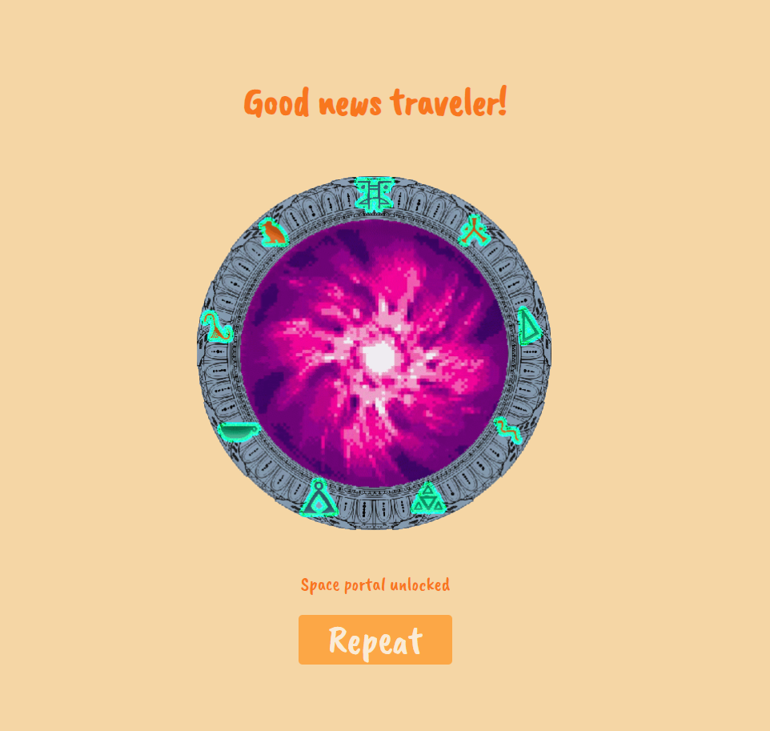

# SUDO SPACE TRAVELER

## Index

[Description](#description)

[API References](#api-references)

- [New Puzzle](#new-puzzle)
- [Solve Puzzle](#solve-puzzle)

[Discarded Idea](#discarded-idea)

[First Discarded Sudoku API](#first-discarded-sudoku-api)

Development

- [Phase 1: HTML and CSS Structure](#phase-1-html-and-css-structure)
- [Phase 2: API and DOM Tests](#phase-2-api-and-dom-tests)
- [Phase 3: Testing User Interaction](#phase-3-testing-user-interaction)
- [Phase 4: Adding Symbols](#phase-4-adding-symbols)
- [Phase 5: Implemented Sudoku](#phase-5-implemented-sudoku)
- [Phase 6: Start Menu and Final Screen](#phase-6-start-menu-and-final-screen)
- [Phase 7: Final Touches](#phase-7-final-touches)

[Backlog](#backlog)

[Project Links](#project-links)

## Description

This is a project to create a Sudoku game based on an API that generates the puzzles and solves them automatically. To give the application some personality and an original touch, the numbers are replaced with symbols.

The new perspective of Sudoku adds a different yet equally playable gaming concept. Although at first it seemed that replacing numbers with symbols might increase the difficulty of the game, after testing, it turned out not to be the case.

## API References

- [API used: Sudoku Board](https://rapidapi.com/andrewarochukwu/api/sudoku-board/)

#### New Puzzle

```http
  GET /api/new-board
```

| Parameter         | Type     | Description                                 |
| :---------------- | :------- | :------------------------------------------ |
| `RapidAPI App`    | `string` | **Required**. The API ID on RapidAPI        |
| `Request URL`     | `string` | **Required**. rapidapi.com                  |
| `X-RapidAPI-Host` | `string` | **Required**. Header provided by RapidAPI   |
| `X-RapidAPI-Key`  | `enum`   | **Required**. Key based on the user         |
| `diff`            | `string` | **Optional**. Puzzle difficulty (default 2) |

#### Solve Puzzle

```http
  GET /api/solve-board
```

| Parameter         | Type     | Description                               |
| :---------------- | :------- | :---------------------------------------- |
| `RapidAPI App`    | `string` | **Required**. The API ID on RapidAPI      |
| `Request URL`     | `string` | **Required**. rapidapi.com                |
| `X-RapidAPI-Host` | `string` | **Required**. Header provided by RapidAPI |
| `X-RapidAPI-Key`  | `enum`   | **Required**. Key based on the user       |
| `sudo`            | `string` | **Required**. Puzzle to be solved         |

## Discarded Idea

The initial idea was to create a search page using one of the APIs from the provided list: [Disney Characters API](https://disneyapi.dev/docs). In this search engine, users could find characters and "like" them or add comments.

Upon analyzing the API during idea approval, we found it had only two endpoints:

```javascript
{
  getAllCharacters: 'https://api.disneyapi.dev/characters',
  getOneCharacters: 'https://api.disneyapi.dev/characters/:id'
}
```

This did not allow direct searches in the API and posed a problem since the only possible action was to obtain complete information with the first GET. The desired functionality for the project, involving multiple API calls, was too limited and was therefore discarded.

## First Discarded Sudoku API

After discarding the first idea, the idea of creating a Sudoku game with the twist of replacing numbers with symbols emerged while researching on RapidAPI.

The first API found was [Solve-Sudoku](https://rapidapi.com/sosier/api/solve-sudoku/).

This API allowed downloading the puzzle and its solution simultaneously but had a limit of 50 searches per day, and obtaining the "key" required credit card registration since, once the 50 searches were exceeded, a fee would be charged.

This option was discarded as the level of requests during development could exceed 50 searches per day, which could incur a cost.

<div class="page-break"></div>

# Development

## Phase 1: HTML and CSS Structure

The first phase consisted of designing possible layouts to present the page and make the layout clear and simple.

The game's visual idea is very simple: a central box with all 81 elements (numbers) inside. Initially, I opted to create a `<ul>` with 81 `<li>` elements inside. It was already obvious from the beginning that these elements should not be manually created this way, but in the testing phase, it was easier to visualize.

With CSS, the most obvious step was converting all list elements into a grid. Setting the cell sizes in `vw` units added a bit of responsiveness, allowing tests on different screen sizes.

Responsiveness is very important in this project as it aims to be a functional game on most devices (prioritizing phones).


No complications here.

## Phase 2: API and DOM Tests

This phase involved testing the API and its interaction with the DOM to render all the puzzle elements correctly and identify possible errors.

The API documentation itself provided examples for making calls using axios, fetch, or XMLHttp.

The first test used `fetch().then()` to execute a call and verify the response saved in a variable.

The returned data consists of an array with 9 elements (representing the 9 rows of the Sudoku), each containing another array with the 9 values of each cell.

```javascript
{1 item
"response":{2 items
  "difficulty":"easy"
  "unsolved-sudoku":[9 items
      0:[9 items // First row
        0:1 // Cell value
        1:0
        2:0
        3:2
        4:5
        5:0
        6:0
        7:8
        8:9
      ]
      1:[...]9 items
      2:[...]9 items
      3:[...]9 items
      4:[...]9 items
      5:[...]9 items
      6:[...]9 items
      7:[...]9 items
      8:[...]9 items
  ]
}
```

To make rendering elements within each cell easier, the first step was to concatenate each row into a single array containing all values together. In other paid Sudoku APIs, the response tends to be like this without dividing by rows, so if the reference API ever needs to be changed, it will be easier to implement.

This array serves as a reference for the grid so that each value matches its corresponding child element as we have it defined: `<ul class="grid">`.

With this foundation, we can already print the values.


### Complications:

- **Asynchronicity and `fetch`**:
  Initial tests involved executing the "getPuzzle" function at the beginning. The behavior was correct, and all elements printed upon the page load, by adding `async` to the script import in the HTML. The problem arose when adding a button to trigger the API call. Finally, it turned out to be easier to request the API through an `async` function since, when using a button as a trigger to print the elements on-screen, `await` could be used to avoid rendering errors due to missing data. Using `fetch().then()` made the code longer with too many `.then()` calls, making it harder to read.

## Phase 3: Testing User Interaction

This phase involves implementing the system for modifying the values of empty cells. First, it is necessary to visually highlight the selected cell by creating a variable that defines the selected cell and adding the "selected" class to it, which changes the background color.

To input values for each cell, creating buttons at the bottom with all possible options seemed the most appropriate. Visually, this aligns with the main grid and allows users to play on phones and other devices without adding too many complications.


### Complications:

- We discarded the idea of using an input field since the keyboard covers part of the screen on phones, making it visually uncomfortable. Additionally, replacing numbers with symbols would make this approach extremely inconvenient.
<div class="page-break"></div>

## Phase 4: Adding Symbols

This phase consists of replacing all the numbers with symbols. Each symbol is created with Photoshop to give an Egyptian touch related to the world of space and space travel. We have three symbols from [Egyptian hieroglyphs](https://en.wikipedia.org/wiki/Egyptian_hieroglyphs), another three from the symbols used in [Star Gate](https://stargate.fandom.com/wiki/Glyph), and another three from the [No Man's Sky](https://nomanssky.fandom.com/wiki/Glyph#:~:text=Summary,-In%2Dgame%20Guide&text=Infographics%20Glyphs%20are%20symbols%20on,symbols%20on%20the%20outer%20ring.) glyph system.

Each number is replaced by one of the symbols, and with the bottom button bar, we have a reference for each one.


<div class="page-break"></div>

### Complications:

- To keep a reference of which number corresponds to each symbol and other properties, testing was done using HTML data attributes. Finally, we discarded this option since the only relevant information was the number, which was already stored in the "alt" attribute of the image. Other properties were related to the HTML class itself, and therefore, it was not necessary to use data attributes.

## Phase 5: Implemented Sudoku

At this stage, the main functionality for playing the game has been implemented. We now proceed with testing to see if the solution to the puzzle we provided is correct. The API itself already sends the puzzle solution, so no additional call is needed, as was the case with other APIs.

We apply the following logic to identify errors:

```javascript
function checkUserSolution() {
  let wrongTiles = 0;

  const tiles = [].slice.call(grid.children);
  for (const [i, tile] of tiles.entries()) {
    if (tile.children[0].alt != solvedPuzzle[i]) {
      grid.children[i].classList.add("wrong");
      wrongTiles++;
    }
  }
  if (wrongTiles > 0) alert(`Wrong answer! you made ${wrongTiles} mistakes`);
  menuContainer.style.display = "none";
}
```

The `const tiles` creates an array with all the cells so that we can check the user's responses. The solution array is already set up to match the indices of the grid, allowing it to correct the incorrect cells by adding the "wrong" class, which changes their background color.

## Phase 6: Start Menu and Final Screen

The start menu is a container that covers the entire screen and provides start options and options to submit the puzzle for verification or view any errors made.

We also have the option to load a new puzzle.

Once the puzzle is submitted, the final screen indicates that we have unlocked the correct combination.



## Phase 7: Final Touches

We add a timer to record the time it takes to solve the puzzle.

```javascript
const timerDOM = document.getElementById("timer");

let timer;

let start = false;
let hours = 0;
let minutes = `0${0}`;
let seconds = `0${0}`;

const resetTimer = () => {
  minutes = `0${0}`;
  seconds = `0${0}`;
  hours = 0;
  timer = `${hours}:${minutes}:${seconds}`;
  timerDOM.innerText = timer;
};

const stopTimer = () => (start = false);
const startTimer = () => (start = true);

setInterval(() => {
  if (start) {
    seconds++;
    seconds < 10 ? (seconds = `0${seconds}`) : (seconds = seconds);
    if (seconds == 60) {
      minutes++;
      seconds = `0${0}`;
      seconds = seconds;
      minutes < 10 ? (minutes = `0${minutes}`) : (minutes = minutes);
    }
    if (minutes == 60) {
      hours++;
      minutes == 60 ? (minutes = `0${0}`) : (minutes = minutes);
    }
    timer = `${hours}:${minutes}:${seconds}`;
    timerDOM.innerText = timer;
  }
}, 1000);

export { stopTimer, startTimer, resetTimer, timer };
```

The app sets the `start` variable to true or false as needed. When the menu is open, the timer is paused as the menu acts like a pause button.

In this phase, we also refactor the code, moving the API call content to a separate file and applying various optimizations.

# Update 1.1

## Adding automatic puzzle generation

After some time without working on the project, I revisited it from time to time realizing that the API used was not working anymore or taking too long to respond.

On this update I added a script in the `scripts` folder that generates a new puzzle and the solution, this function is called instead of the API call.  It also has a difficulty parameter.

# Backlog

As the game was being developed, several ideas emerged that could not be implemented:

- Add difficulty levels
- Add sounds and music
- User CRUD
- Leaderboard for best scores

In one of the tutorial meetings, the proposal was made to divide the columns or cells into groups, as is common in some Sudoku variations, making the separation between each group of three cells more noticeable. This was not possible to implement in time as the game is based on a grid, and the gaps cannot be different depending on the column or row.

Tests involving adding margins, paddings, shadows, etc., did not yield aesthetically pleasing results, so we ultimately decided not to implement this. The most efficient solution would probably involve dividing the board into several grids and rethinking the entire logic.

# Project Links

## [GitHub Repository](https://github.com/Marshall-Bits/sudoku--project)

## [App on GitHub Pages](https://marshall-bits.github.io/sudoku--project/)
