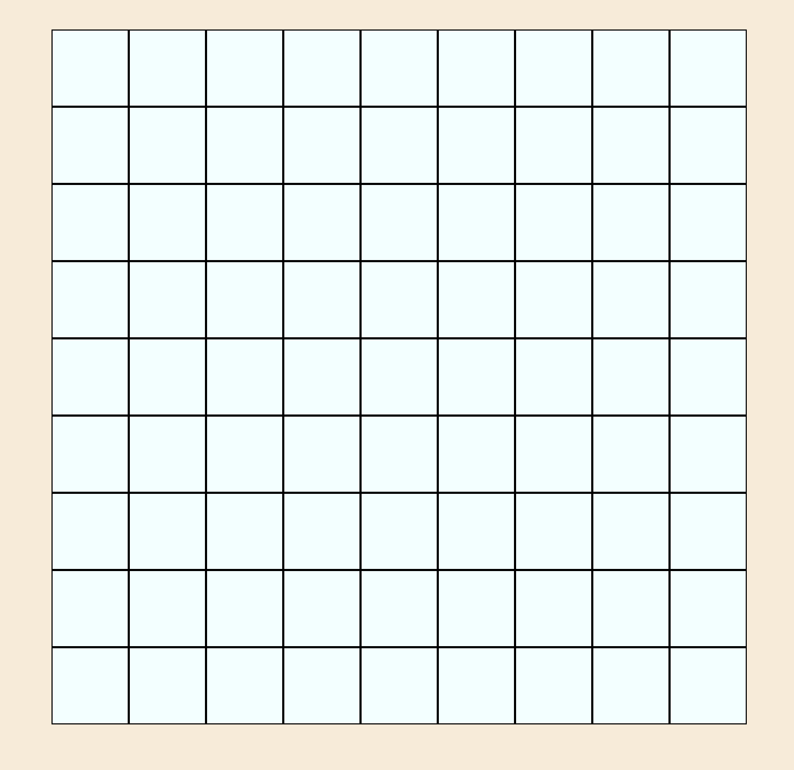
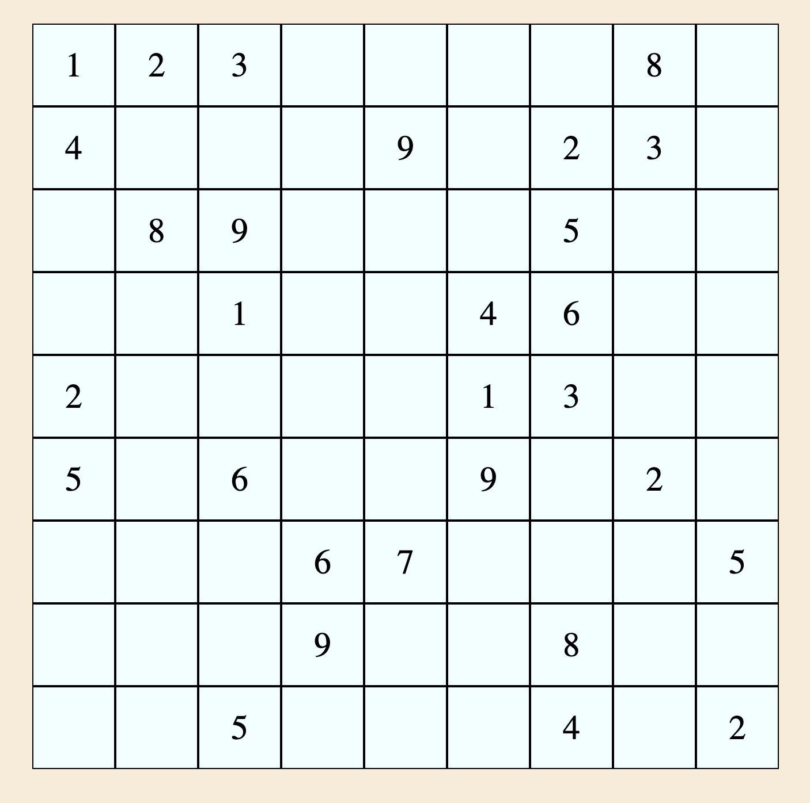
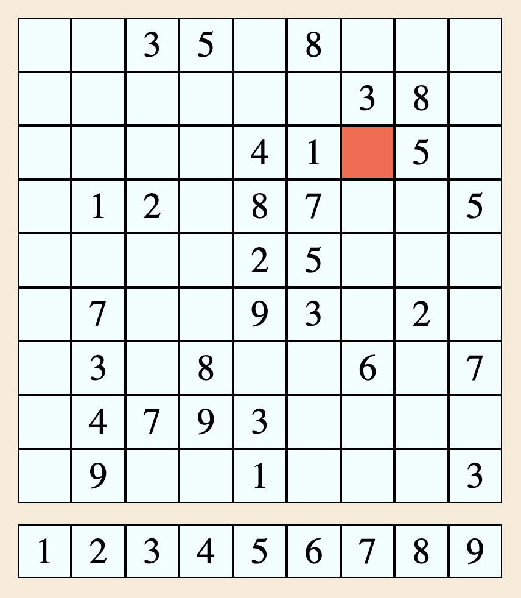

# Project Sudoku

## Index 
[Descripció](#descripció)

[Referències API](#referències-api)

- [Nou trencaclosques](#nou-trencaclosques)
- [Resoldre trencaclosques](#resoldre-trencaclosques)

[Idea descartada](#idea-descartada)

[Primera API sudoku descartada](#primera-api-sudoku-descartada)

Desenvolupament

- [Fase 1: estructura html i css](#fase-1-estructura-html-i-css)
- [Fase 2: Tests amb API i DOM](#fase-2-tests-amb-api-i-dom)
- [Fase 3: Testejant interacció de l'usuari](#fase-3-testejant-interacció-de-lusuari)
## Descripció 

Aquest és un projecte de creació d'un joc de sudoku partint d'una API que genera els trencaclosques i els resol de manera automàtica. Per donar personalitat a l'aplicació i un toc original els nombres es substitueixen per símbols.

 
## Referències API 
 - [API utilitzada: Sudoku Board](https://rapidapi.com/andrewarochukwu/api/sudoku-board/)

#### Nou trencaclosques

```http
  GET /api/new-board
```

| Paràmetre | Tipus     | Descripció                |
| :-------- | :------- | :------------------------- |
| `RapidAPI App` | `string` | **Required**. La ID de la API a RapidAPI|
| `Request URL` | `string` | **Required**. rapidapi.com |
| `X-RapidAPI-Host` | `string` | **Required**. Header proporcionat per RapidAPI |
| `X-RapidAPI-Key` | `enum` | **Required**. Key segons l'usuari |
| `diff` | `string` | **Optional**. Dificultat del trencaclosques (per defecte 2) |

#### Resoldre trencaclosques

```http
  GET /api/solve-board
```

| Paràmetre | Tipus     | Descripció                |
| :-------- | :------- | :------------------------- |
| `RapidAPI App` | `string` | **Required**. La ID de la API a RapidAPI|
| `Request URL` | `string` | **Required**. rapidapi.com |
| `X-RapidAPI-Host` | `string` | **Required**. Header proporcionat per RapidAPI |
| `X-RapidAPI-Key` | `enum` | **Required**. Key segons l'usuari |
| `sudo` | `string` | **Required**. Trencaclosques a resoldre |


## Idea descartada

La idea inicial era crear una pàgina tipus buscador utilitzant una de les 
API del llistat proporcionat: [API personatges disney](https://disneyapi.dev/docs).
En el buscador es podrien trobar personatges i donar "like" o posar comentaris. 

Al analitzar la API durant l'aprovació de la idea vam veure que només tenia 
dos endpoints: 

```javascript
{
  getAllCharacters: 'https://api.disneyapi.dev/characters',
  getOneCharacters: 'https://api.disneyapi.dev/characters/:id'
}
```

Això no permetia fer recerques directament a la API i suposava un problema ja que l'únic
que permetia era obtenir la informació complerta amb el primer GET. La funcionalitat
desitjada pel projecte de fer diverses crides a la API quedava massa reduïda i, per tant,
descartada.

## Primera API sudoku descartada

Un cop descartada la primera idea, fent recerca per rapidAPI va sorgir la idea de crear un 
joc de sudoku amb la peculiaritat de que els nombres fossin substituïts per símbols.

La primera API trobada va ser [Solve-sudoku](https://rapidapi.com/sosier/api/solve-sudoku/).

Aquesta API permetia descarregar el trencaclosques i la solució alhora però tenia una
limitació de 50 cerques diàries i, per aconseguir la "key", calia fer un registre de 
la targeta de crèdit ja que, un cop superades les 50 cerques, es carregava un import.

Aquesta opció doncs, va quedar també descartada degut a que el nivell de peticions
durant el desenvolupament podia superar les 50 cerques al dia i suposaria un cost. 

# Desenvolupament

## Fase 1: estructura html i css

La primera fase consistia en veure possibles estructures per tal de presentar la pàgina i com poder fer la maquetació entenedora i senzilla.

La idea del joc és molt senzilla a nivell visual, un simple requadre central amb els 81 elements de tots els nombres al seu interior. 

Vaig optar inicialment per crear una ```<ul>``` amb els 81 elements ```<li>``` interiors. 
Ja era obvi des d'un inici que aquests elements no haurien de ser creats de forma manual així però en fase de proves era molt més visual i entenedor.

Amb CSS la part més òbvia inicialment era convertir tots els elements de la llista en una grid. La mida de les cèl·les en vw ja crea una mica d'efecte "responsive" i, per tant, es poden fer tests en diverses mides.

La "responsivitat" en aquest projecte té un gran pès ja que es pretén que sigui un joc funcional a la majoria de dispositius (prioritzant telèfons). 



No hi ha complicacions en aquest apartat. 
## Fase 2: Tests amb API i DOM

Aquesta fase consistia en testejar l'API i la seva relació amb el DOM per tal d'aconseguir renderitzar tots els elements del trencaclosques de manera correcte i veure possibles errors.

La pròpia documentació de la API ja proporciona exemples de com fer les crides amb axios, fetch o XMLHttp.

La primera prova va ser amb fetch executant una crida i comprovant la correcta resposta guardada en una variable. 

La data retornada consisteix en un array amb 9 elements (corresponents a les 9 files del sudoku) que contenen un altre array amb els 9 valors de cada cel·la.

```javascript
{1 item
"response":{2 items
  "difficulty":"easy"
  "unsolved-sudoku":[9 items
      0:[9 items //Primera fila
        0:1 //Valor de la cel·la
        1:0
        2:0
        3:2
        4:5
        5:0
        6:0
        7:8
        8:9
      ]
      1:[...]9 items
      2:[...]9 items
      3:[...]9 items
      4:[...]9 items
      5:[...]9 items
      6:[...]9 items
      7:[...]9 items
      8:[...]9 items
  ]
}
```
Per tal de fer més fàcil la renderització dels elements dins de cada cèl·la el primer és concatenar cada fila per tal de tenir un array amb tots els valors junts. En altres API de sudoku de pagament la resposta sol ser així sense la divisió per files, per tant, en el cas de que en algun moment s'hagués de canviar l'API de referència seria també més fàcil fer el canvi.

Aquest array ens servirà prenent com a referència la grid per tal de que tingui cada valor el seu índex corresponent coincidint amb els elements child tal i com la tenim definida: ```<ul class="grid">```. 

Amb aquesta base ja podem imprimir els valors. 


### Complicacions:

- "Asincronicitat" i ```fetch```:  
Les proves es van fer executant la funció de "getPuzzle" a l'inici, el comportament era correcte i tots els elements s'imprimien per pantalla al iniciar la pàgina carregant l'script afegint ```async```.   
El problema va sorgir a l'hora d'afegir un botó per tal de fer la crida.  
Finalment resulta més fàcil fer la petició a l'API a través d'una funció ```async``` ja que quan fem servir un botó de "trigger" per imprimir els elements en pantalla podem fer servir ```await``` i no tindrem errors d'intentar renderitzar sense data. Fent servir ```fetch``` semblava que el codi es feia més extens amb masses línies de ```.then``` i era més difícil de llegir.

## Fase 3: Testejant interacció de l'usuari

Aquesta fase consisteix en implementar el sistema per començar a modificar els valors de les cèl·les buides.
Cal destacar visualment, en primer lloc, la cèl·la sel·leccionada. Simplement creant una variable la qual defineixi quina és aquella cel·la i afegir-li la classe "selected" que farà que el color de fons es modifiqui. 

Al pensar en el sistema per introduir els valors de cada cel·la el més apropiat va semblar crear uns botons a la part inferior amb totes les opcions possibles. Visualment això concorda amb la grid principal i ens serveix perfectament per jugar en telèfon i d'altres dispositius sense afegir massa complicacions.


### Complicacions:
- Descartem la idea d'utilitzar un input ja que en telèfons apareix el teclat que tapa part de la pantalla i es fa incòmode visualment. A més, la idea inicial de substituir els nombres per símbols ho faria extremadament incòmode. 